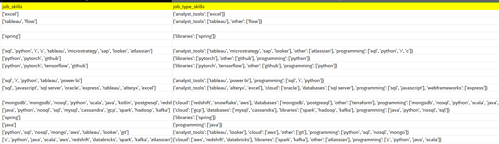

# Data-Job-Market-End-To-End-Analysis-Project

This project analyses roughly 500,000 tech job postings from the 2024 DataNerd.com data job dataset to understand trends within the current data and tech job market. The analysis pipeline combines SQL-driven data extraction, Python and Excel for data cleaning and exploratory analysis, and interactive Power BI dashboards to present insights clearly and visually.

## Project Backgorund / Motivation

I’m studying Computer Science and Statistics, and I wanted to explore what the future job market might look like for someone with my skill set. This dataset of data and tech job postings gave me a realistic way to investigate questions like:

- How do salaries compare between different roles and locations?
- How available are remote or hybrid positions?
- Which technical skills are most in demand?
- What's the split between junior, mid, and senior roles?

#### This project demonstrates the following essential data analytics skills:

- Cleaning and transforming messy data
- Building a repeatable SQL based workflow
- Performing exploratory data analysis in Python & Excel
- Creating interactive visualisations with Power BI that communicate clearly communicate insights for a non-technical audience

## Data Dictionary

| Column Name             | Description                                                               | Type        | Source           |
| ----------------------- | ------------------------------------------------------------------------- | ----------- | ---------------- |
| `job_title_short`       | Cleaned/standardized job title using BERT model (10-class classification) | Calculated  | From `job_title` |
| `job_title`             | Full original job title as scraped                                        | Raw         | Scraped          |
| `job_location`          | Location string shown in job posting                                      | Raw         | Scraped          |
| `job_via`               | Platform the job was posted on (e.g., LinkedIn, Jobijoba)                 | Raw         | Scraped          |
| `job_schedule_type`     | Type of schedule (Full-time, Part-time, Contractor, etc.)                 | Raw         | Scraped          |
| `job_work_from_home`    | Whether the job is remote (`true`/`false`)                                | Boolean     | Parsed           |
| `search_location`       | Location used by the bot to generate search queries                       | Generated   | Bot logic        |
| `job_posted_date`       | Date and time when job was posted                                         | Raw         | Scraped          |
| `job_no_degree_mention` | Whether the posting explicitly mentions no degree is required             | Boolean     | Parsed           |
| `job_health_insurance`  | Whether the job mentions health insurance                                 | Boolean     | Parsed           |
| `job_country`           | Country extracted from job location                                       | Calculated  | Parsed           |
| `salary_rate`           | Indicates if salary is annual or hourly                                   | Raw         | Scraped          |
| `salary_year_avg`       | Average yearly salary (calculated from salary ranges when available)      | Calculated  | Derived          |
| `salary_hour_avg`       | Average hourly salary (same logic as yearly)                              | Calculated  | Derived          |
| `company_name`          | Company name listed in job posting                                        | Raw         | Scraped          |
| `job_skills`            | List of relevant skills extracted from job posting using PySpark          | Parsed List | NLP Extracted    |
| `job_type_skills`       | Dictionary mapping skill types (e.g., 'cloud', 'libraries') to skill sets | Parsed Dict | NLP Extracted    |

## Exploratory Data Analysis

The goal of this EDA was to understand and familiarise myself with the structure and the different patterns/trends of the dataset. My familiarity of the dataset is crucial for when I go into deeper analysis later on. The analysis was performed using Python with the pandas, matplotlib library. All code, visualizations, and detailed analysis are available in this [Jupyter Notebook](data_jobs_eda.ipynb).

#### Considering Hypothesis Testing:

I considered performing hypothesis testing during this EDA to evaluate statistical significance between variables (e.g., salary differences between job titles or countries). However, because this dataset represents a scraped population of job listings rather than a random sample, descriptive and exploratory analysis provides more meaningful insights than inferential statistics. So for this project, I decided hypothesis testing was not necessary.

#### Important Things I discovered about the overall structure of the dataset from this EDA:

- Many salary fields are missing because companies often don’t provide salary information, or they list only yearly or hourly pay.
- The job_skills and job_type_skills columns use non‑tabular formats (Python lists and JSON), which makes them difficult to query and requires cleaning.
- Not all of these columns are for analysis. For example, search_location doesn’t add value and will be removed during cleaning.

#### Intersting and Potentially Insightful Data from this EDA:

- The salary ceiling is around $400k - $920k
- Machine Learning and Software Engineers have higher salaries than other job titles.
- The most in demand job titles were the Data Jobs - Data Engineers, Data Analysts, and Data Scientists.
- The top 5 countries with the most job listings were the U.S., India, The U.K., France, and Germany.

## Data Cleaning and Schema Normalization

#### Non-tabular Columns


The original dataset contained two problematic columns: job_skills and job_type_skills. These fields were stored as Python lists and nested JSON dictionaries, which are difficult to query and analyze in SQL-based environments like Power BI (for further analysis later).

To enable relational analysis, I restructured the dataset by removing these columns from the `job_postings` table and transforming them into normalized tables. This process allowed me to build a clean schema that relationally connects `job_postings`, `job_skills`, and `job_skill_categories`.

#### Transformation Process Summary

- With the help of Excel and Power Query, I was able to extract the data in the original dataset and create separate CSVs representing the different tables (inside the Schema Folder).
- I extracted all of the unique job skills and associated categories from the `job_skills` and `job_type_skills` columns in the original dataset.
- A unique identifier was assigned for each unique skill and category.
- Every job posting was then connected to its corresponding skill(s).
- Each skill was also connected to its category to complete the normalized relational structure.
  

#### Other Data Cleaning Processes

- Removed unnecessary columns: Columns such as search_location did not contribute meaningful information to the analysis, so they were dropped to simplify the schema.
- Standardized text formatting for the `job_skills` names - ensured consistent casing, spelling, and removing whitespace.
- Removed Duplicates: There were many job skills that were the same but spelt differently or abbreviated, so those duplicate skills were removed.
- Checked referential correctness to ensure IDs and relationships aligned across tables.

## Schema Architecture in MySQL

I implemented the ERD I designed into a fully normalized, relational, schema in MySQL that follows the industry-standard star-schema design, allowing slicing of the data by any of the categorical columns - [text](main.sql). This relational schema ensures:

- Fast, efficient querying across hundreds of thousands of rows
- Referential integrity between job postings, skills, and skill categories
- Scalable joins for skill‑based salary analysis, demand trends, and cross‑country comparisons
- A repeatable ingestion pipeline that can be re‑run as new data becomes available

#### Schema Overview

The database consists of four core tables:

- `job_postings` - the main fact table containing cleaned job metadata.
- `job_skills` - a dimension table of unique skills extracted from the original dataset.
- `job_skill_categories` - a lookup table grouping skills into specific categories.
- `job_skill_connector` - a bridge table implementing a many-to-many relationship between job postings and skills.

#### Data Ingestion

To handle large CSV imports (400k + job postings and 1m + job skill connections), I implemented a high‑performance loading process using LOAD DATA INFILE, temporarily disabling foreign key checks to speed up ingestion while preserving integrity once loading is complete. Below is the query I wrote to import the job_skills_connector csv, which had 1 million + rows of data.

```
LOAD DATA INFILE 'C:/ProgramData/MySQL/MySQL Server 8.0/Uploads/job_skill_connector.csv'
IGNORE -- Skip duplicates
INTO TABLE job_skill_connector
FIELDS TERMINATED BY ','
OPTIONALLY ENCLOSED BY '"'
LINES TERMINATED BY '\r\n'
IGNORE 1 ROWS;
```

The importing process takes a minute max. If I were to use the traditional Table Data Import Wizard to import the CSVs into the tables, it would take a couple of hours (I know this because I tried this method at first...).

#### Unified Job-Skill-Connector View

To connect each job posting to its associated skills and each skill to its broader category, I created a unified SQL view that encapsulates the full many‑to‑many relationship across the schema. Instead of repeatedly writing long join statements, this view provides a single, analysis‑ready structure that downstream tools can query directly.

```
CREATE OR REPLACE VIEW v_job_skill_analysis AS
SELECT
    jp.job_id,
    jp.job_title_short,
    jp.job_location,
    jp.job_country,
    jp.company_name,
    jp.job_schedule_type,
    jp.job_work_from_home,
    jp.job_posted_date,

    -- Financial columns
    jp.salary_year_avg,
    jp.salary_hour_avg,

    -- Skill data for the many-to-many relationship
    js.skill_name,
    jsc.category_name
FROM
    job_postings AS jp
INNER JOIN job_skill_connector AS jconn ON jp.job_id = jconn.job_id
INNER JOIN job_skills AS js ON jconn.skill_id = js.skill_id
INNER JOIN job_skill_categories AS jsc ON js.category_id = jsc.category_id;

```

The `v_job_skill_details` view acts as the main analytical interface for the project. It allows all relevant data to be shown through a single, query‑ready structure. This makes it easier to perform further analysis and build interactive dashboards without repeatedly reconstructing complex joins.
